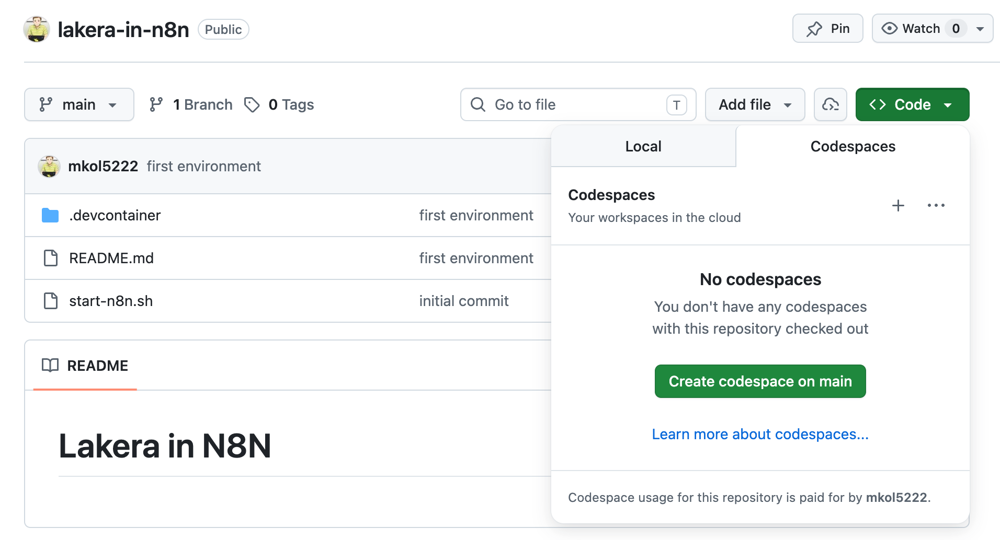
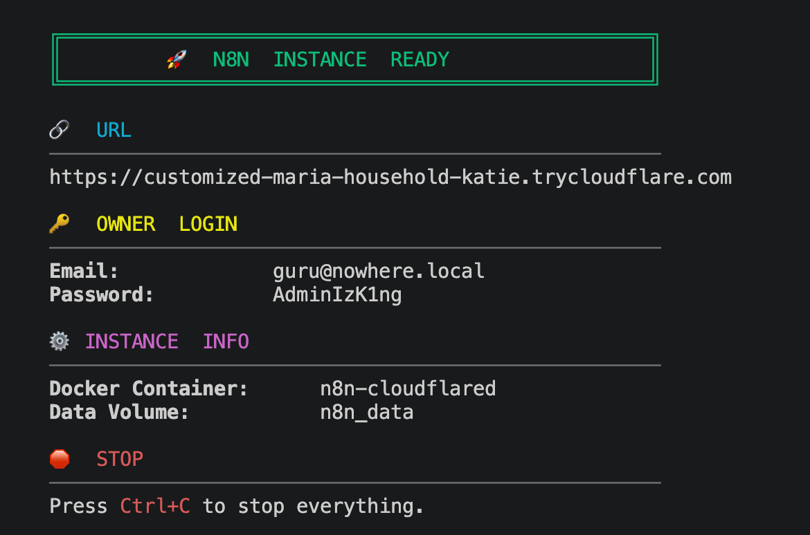

# Lakera in N8N

## Usage

1. Log in to [GitHub](https://github.com/) in your browser.
2. Visit [mkol5222/lakera-in-n8n](https://github.com/mkol5222/lakera-in-n8n).
3. Click the green **Code** button and select the **Codespaces** tab.
4. Click the green **Create codespace on main** button.

   

5. Be patient. Codespace will open in the browser. N8N deployment on a publicly accessible URL will be automatically created for you. This may take a few (or more) minutes.
6. Check the terminal (dev container build progress) for the URL of your N8N instance. Click the URL to open your N8N instance in a new browser tab.

   

7. N8N instance access information is also stored in newly created file [N8N-ACCESS.md](N8N-ACCESS.md) in the root of the repository.
8. Login to your N8N instance using the **credentials** from the terminal output or from the [N8N-ACCESS.md](N8N-ACCESS.md) file.
9. You can now start using N8N to learn about Lakera AI integration.
10. Here is table of bundled workflows to get you started by import from the [workflows](workflows) folder in this repository:

    | Workflow Name | Description | Raw URL (copy to import) |
    | --- | --- | --- |
    | Get Public IP | Retrieves the public IP address of the N8N instance | <code>https://raw.githubusercontent.com/mkol5222/lakera-in-n8n/refs/heads/main/workflows/get-public-ip.json</code> |
    | Prompt Roulette | Demonstrates Lakera AI integration with N8N | <code>https://raw.githubusercontent.com/mkol5222/lakera-in-n8n/refs/heads/main/workflows/prompt-roulette.json</code> |